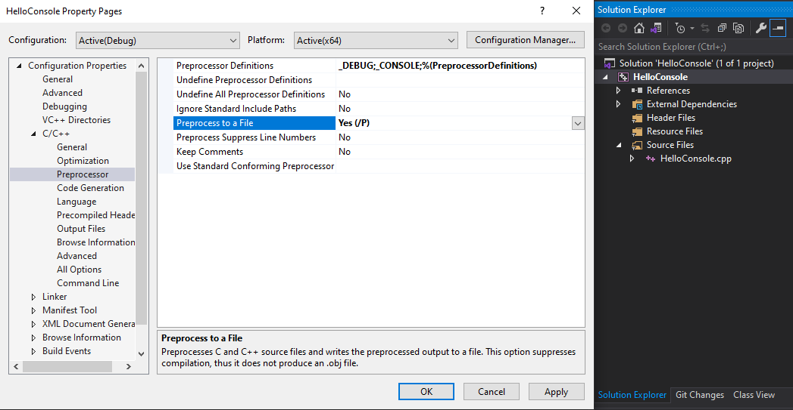

<!--prettier-ignore-start-->
# The Build Process
{: .no_toc }

In this section we will look at the build steps taken when preparing a C++ program for execution.

### Table of Contents
{: .no_toc }

1. TOC
{:toc}

<!--prettier-ignore-end-->

## Running C++ Programs

Before a C++ program can be run it must first be built into an executable program. The build process converts your source code files, which are text files, into the machine instructions understood by your CPU. These instructions are then written to a binary executable format specific to your operating system.

The build process for a C++ program includes three parts that are performed in this order:

- Preprocessing
- Compilation
- Linking

## The Preprocessor

The preprocessor reads through your source code files for _directives_, which are instructions to preprocess the contents of your source code files before compilation occurs. These directives all begin with a `#` and must be the first thing (other than whitespace) on a given line of source.

These directives allow you to do things like create replacement macros or to conditionally include/exclude parts of your source code from compilation.

⚡ Warning:
{: .label .label-red}

Preprocessor directives are not statements, so they should not be terminated by semicolons.
{: .d-inline-block}

## Preprocessor Directives - Header Includes

The most common preprocessor directive is an `#include` statement. These statements are used to include the contents of another file in place of the `#include` statement. The included files might be those you have written yourself, or they can be from the C++ standard library.

For example, a source file called `grinner.cpp` might start with a directive like this:

```cpp
#include "grinner.h" // Quotes and a trailing file extension used for relative file locations.
#include <iostream>  // Triangle braces with no file extension used for standard library includes.
```

When executing this directive, the preprocessor looks for a file called `grinner.h` in the same folder as `grinner.cpp` (and in other configurable locations). The `#include` directive is then replaced by the contents of the `grinner.h` file. Next, the contents of the standard library input-output stream header will be copied into the file.

You can think of `#include` directives like a copy-paste, from one file to another.

🎵 Note:
{: .label .label-yellow}

The preprocessor doesn't permanently change the file when processing an include.
{: .d-inline-block}

## Preprocessor Directives - Constants and Macros

The `#define` directive can be used to create simple macro functions or to define constants.

Here's an example of defining a constant called `PI` that can be then used to mean `3.14159`:

```cpp
#define PI 3.14159
// Later on in the code:
double radius = 3;
double area = PI * radius * radius;
```

Here's an example of a macro function defined using this directive:

```cpp
// Define a macro that will return the minimum of two given numbers:
#define MIN(a,b) (((a)<(b)) ? a : b)
// Later on in the code:
int a = 300;
int b = 200;
int smallest = MIN(a, b);
```

⚡ Warning:
{: .label .label-red}

Defining constants in this manner is no longer recommended.
{: .d-inline-block}

## Preprocessor Directive - Conditional Compilation

The `#ifdef`, `#ifndef` directives can be used in combination with `#define` to conditionally include/exclude portions of your code.

Here's an example of implementing a debug-mode controlled by the presence of a `#define`:

```cpp
#define DEBUG
// Later on in the code:
#ifdef DEBUG // If DEBUG is defined.
  cout << "In debug mode!\n";
#endif
#ifndef DEBUG // If DEBUG is *not* defined.
  cout << "Not in debug mode.\n";
#endif
```

## Preprocessor Directive - Include Guards

You will often see `#define` and `#ifndef` directives used to ensure that a header file isn't accidentally `#include`-ed multiple times.

In a header file called `grinner.h`:

```cpp
#ifndef GRINNER_H
#define GRINNER_H // Once defined the ifndef above will no longer be true.
// The entire contents of the header file would go here.
#endif
```

🎵 Note:
{: .label .label-yellow}

It's now more common to use the `#pragma once` instead of header include guards:
{: .d-inline-block}

```cpp
#pragma once
// The entire contents of the header file would go here.
// No need to close the #pragma statement with another directive at the end of the file.
```

## Inspecting the Results of Preprocessing

{: .inline .small}

If you wish to see the results of the preprocessor, you can configure Visual Studio to output this step to a file.

Let's do this with the [Hello Console app we created in the previous module](/docs/01-cpp-and-visual-studio-tour/01-cpp-and-visual-studio-tour.html#a-tale-of-two-programs):

- Open the `HelloConsole` app in Visual Studio.
- Right-click on `HelloConsole` in the Solution Explore, and select `properties`.
- From there navigate to the `C/C++` section and then go to the `Preprocessor` section.
- Change the `Preprocess to a File` option to `Yes`.
- Click `Apply` then `OK` on the properties window.
- Right-click `HelloConsole.cpp` in the Solution Explorer and pick `Compile`.
- Open the `HelloConsole\x64\Debug\HelloConsole.i` file to see the preprocessed cpp file.
- Try adding other preprocessor directives to the `HelloConsole.cpp` file and recompile to see the results.

⚡ Warning:
{: .label .label-red}

Set `Preprocess to a File` back to `No`. Otherwise you won't be able to build your project.
{: .d-inline-block}

## The Compiler

Once the preprocessing step is complete, compilation can begin. It's the compiler's job to turn each _translation unit_ into _an object file_. In most cases a translation unit is equivalent to a single `.cpp` file. The generated object files include the machine instructions that relate to the specific translation unit. In Windows environments these object files are given a `.obj` file extension, on Mac and Linux machines the file extension used is `.o`.

During compilation your source code will be parsed into what is called an AST, or an [Abstract Syntax Tree](https://en.wikipedia.org/wiki/Abstract_syntax_tree), which is a data structure used to represent your source code as a tree-like graph of nodes and connections. It's this AST that is then converted into machine code. It's during this process that the compiler may report syntax errors or type errors that it finds.

## Inspecting the Results of the Compiler

The object files created by the compilation process are available to you, but because they are binary files opening them won't show you much other than binary data. If you want to see the equivalent [assembly language](https://en.wikipedia.org/wiki/Assembly_language) generated by the compiler for each object file there's another Visual Studio setting for that.

Again with the [Hello Console app we created in the previous module](/docs/01-cpp-and-visual-studio-tour/01-cpp-and-visual-studio-tour.html#a-tale-of-two-programs):

- Open the `HelloConsole` app in Visual Studio.
- Right-click on `HelloConsole` in the Solution Explore, and select `properties`.
- From there navigate to the `C/C++` section and then go to the `Output Files` section.
- Change the "Assembler Output" option to `Assembly-Only Listing (/FA)`.
- Click `Apply` then `OK` on the properties window.
- Right-click `HelloConsole.cpp` in the Solution Explorer and pick `Compile`.
- Open the `HelloConsole\x64\Debug\HelloConsole.asm` file to see the generated assembly code.
- Search this file for the string `Hello World` to see where it's used in the assembly.
- Remember to disable this setting afterwards.

## The Linker

The final step in the build process is to take the various object files and link them together into a binary executable. On Windows machines the file output by the linker will have an `.exe` file extension. On Mac and Linux machines the linker's output file will often be assigned a `.out` file extension and will be marked as an executable on the filesystem.

The most common errors generated during this step will have to do with undefined references to functions used in your source code. The linker will also complain if your source code does not include an entry point function, which is usually a function called `main()`. The entry point function is the function that is automatically called when you run the executable produced by the linker.

Linkers can also be used to create static or dynamic binary library files.

## Further Reading

- [Other Preprocessor Directives Not Covered Here](https://en.cppreference.com/w/cpp/preprocessor)
- [More Information on Static and Dynamic Libraries](https://www.geeksforgeeks.org/static-vs-dynamic-libraries/)
