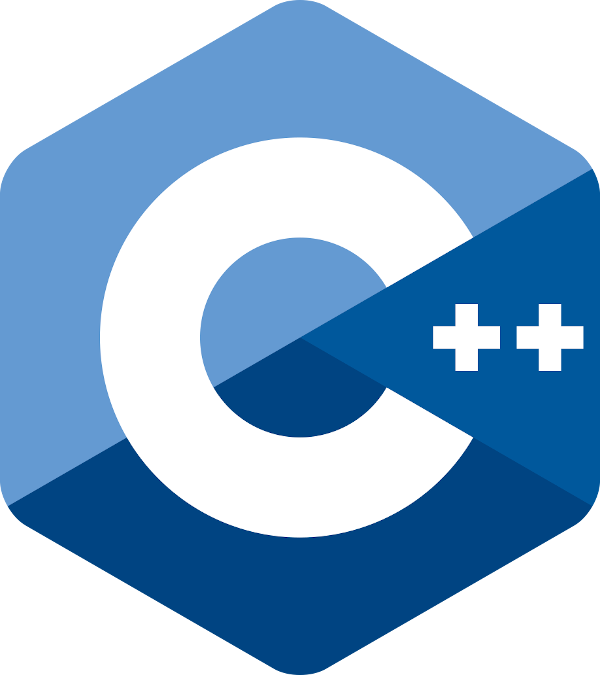

<!--prettier-ignore-start-->
# Brief History of the C++ Language
{: .no_toc }

This section provides a brief history of the C++ programming language from the 1970s until today. We'll also explore what "Modern C++" means and review why this 40-year-old technology remains relevant today.

### Table of Contents
{: .no_toc }  

1. TOC
{:toc}

<!--prettier-ignore-end-->

## In the Beginning There Was C

{:class="small inline"}

[The C programming language](<https://en.wikipedia.org/wiki/C_(programming_language)>) was created in the 1970s at the American research organization [Bell Labs](https://en.wikipedia.org/wiki/Bell_Labs). Bell researchers at that time were also developing [the Unix operating system](https://en.wikipedia.org/wiki/Unix). C was created by [Ken Thompson](https://en.wikipedia.org/wiki/Ken_Thompson) and [Dennis Ritchie](https://en.wikipedia.org/wiki/Dennis_Ritchie) as a system language for Unix. The kernels of most modern operating systems (Windows, Mac, Linux) are still written in C to this day.

## C With Classes

{:class="small inline"}

In the late 70s [Bjarne Stroustrup](https://en.wikipedia.org/wiki/Bjarne_Stroustrup) (also at Bell Labs) started work on what would later become [the C++ programming language](https://en.wikipedia.org/wiki/C%2B%2B). Stroustrup's work on the language started by extending C to support the then-new coding paradigm of [object-orientation](https://en.wikipedia.org/wiki/Object-oriented_programming). The language was renamed from "C with Classes" to C++ in 1984 as a nerdy joke: The increment operator in C is the `++` operator, so C++ is "one more than" C, or in other words, an improvement on C.

## Standardization

{:class="small inline"}

The first book on C++ was written by Stroustrup in 1985 but the language wasn't fully formalized until 1998 when in became an [ISO](https://en.wikipedia.org/wiki/International_Organization_for_Standardization) standard. Since this standardization, changes to C++ are managed by [the C++ Standards Committee](https://isocpp.org/std/the-committee). Since 2011 the committee has been releasing a new version of C++ every three years. The major versions being C++98 (1998), C++03 (2003), C++11 (2011), C++14 (2014), C++17 (2017) and C++20 (2020).

With each new version of the language come new language features and standard library improvements. You'll often hear language featured referred to as specific to a version of the language, as in "Oh, that's a C++14 feature."

## Modern C++

Another thing you'll often hear in the C++ world are mentions of "Modern C++". There's no real definition of what makes a particular feature or usage of the language modern. In fact every time a new version of the language is released its new features are often referred to as "Modern C++".

Separate from the language, the term "Modern C++" can also refer to newer best practices for designing, writing, and building C++ applications.

In this course we'll study C++ from both a "Modern C++" and a "Legacy C++" perspective. The hope is that you learn to write new code in the modern fashion, with the ability to maintain existing code.

## Why C++

Here are some of the reasons why C++ remains such a popular language:

- **Flexible:** It supports different coding styles including imperative, object-oriented, generic, and functional programming.
- **Safe:** The language is statically-typed, meaning the compiler can catch a wide range of type-related bugs.
- **Performant:** With data types that map directly to machine hardware the compiler can produce highly optimized native code.
- **Cross-Platform:** Carefully written C++ can be compiled to run on different CPU architectures and for different operating systems.
- **"Batteries-Included":** C++ ships with an excellent standard library that includes high-quality implementation of commonly needed data-structures and algorithms.

## Further Reading

- [Foundations of C++ by Bjarne Stroustrup](https://www.stroustrup.com/ETAPS12-corrected)
- [C++ on Wikipedia](https://en.wikipedia.org/wiki/C%2B%2Bs)
- [History of C++: 1979 to 1991 by Bjarne Stroustrup](https://www.stroustrup.com/hopl2.pdf)
