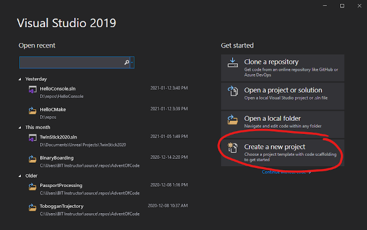
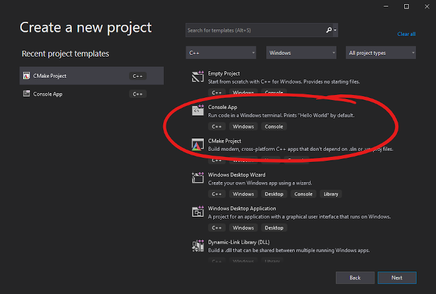
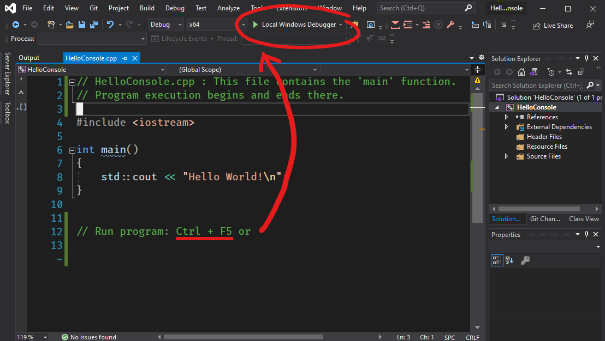

<!--prettier-ignore-start-->
# Tour of C++ and Visual Studio 
{: .no_toc }

This section begins with a line-by-line walkthrough of a short C++ program. After that we'll explore two methods for creating C++ console applications using Visual Studio.

### Table of Contents
{: .no_toc }  

1. TOC
{:toc}

<!--prettier-ignore-end-->

## Hello C++

Without further ado, here's our first look at a C++ program. Try running and editing the program on Compiler Explorer.

```cpp
#include <iostream>
#include <string>

// The main function is the entry point of our program.
int main() {
  std::cout << "Hello World!\n";
  std::string adjective{ "wonderful" };
  std::cout << "Welcome to the " << adjective << " world of C++." << "\n";
  return 0;
}
```

## Line-By-Line Code Walk-Through

These explantions are purposefully over-simplified. We'll get into more details later.

```cpp
#include <iostream>
```

We use `#include` statements to import code from other files, including built-in and third-party libraries. Here we are including `iostream` which is the standard library for input and output on the operating system's [standard I/O and error streams](https://en.wikipedia.org/wiki/Standard_streams).

```cpp
#include <string>
```

The `string` data type is not built into the core language. Strings are defined in the `string` library within the `std` namespace. Namespaces are used to organize code without polluting the global namespace.

```cpp
// The main function is the entry point of our program.
```

Single line comments in C++ begin with a double forward slash. C++ also includes multiline comments that start with `/*` and end with `*/`.

```
int main() {
```

Every C++ program needs an entry point. The entry point is the function that is executed when we run a compiled version of the program. The default name for the entry point is `main`. The `int` denotes that this main function will return a whole number (integer) value to the OS. The curly braces denotes the start of the main function.

```cpp
std::cout << "Hello World!\n";
```

The `cout` function is how we write to the console's standard output. `cout` is defined in the `std` namespace in the `iostream` library. We use the `::` scope resolution operator to access the function within the namespace. The `<<` insertion operator is how we stream data to i/o streams. Note that this and all the other statements in the `main` function are terminated with a semicolon.

```cpp
std::string adjective{ "wonderful" };
```

Here we are declaring a variable of type `string` with an initial value of `"wonderful"`. The `string` data type is also defined within the `std` namespace. We could also have assigned the string its value with the `=` operator like this: `std::string adjective = "wonderful";`

```cpp
std::cout << "Welcome to the " << adjective << " world of C++." << "\n";
```

Another call to `cout`. Note that we can chain multiple `<<` insertion operators with a single call to `cout` and that we can mix hard-coded string literals with variables in these chains.

```cpp
return 0;
```

The main entry point can return an optional integer value to the operating system that is executing the program. If we don't specify a return for `main` then `0` will be returned by default. Returning zero means the program ran successfully. Non-zero return values indicate errors.

```cpp
}
```

The final curly brace denotes the end of the `main` function.

## Hello World with Visual Studio

Let's create two "Hello World" programs using Visual Studio:

1. A standard Visual Studio console application targetting Windows.
2. A cross-platform console application using the CMake build system.

## Start By Launching Visual Studio

{:class="small inline"}

For both of these programs we start by launching Visual Studio and clicking on the "Create a new project" button.

Click on the thumbnail Visual Studio screenshots to see larger versions.

## A Tale of Two Programs

{:class="small inline"}

Try creating two new projects:

- Create a "Console App" with the project and solution name of: `Hello Console`
- Create a CMake Project" with the project and solution name of: `Hello Cmake`

Save these projects to a folder dedicated to programs for this course.

Note that Visual Studio makes a distinction between what it calls Projects and what it calls Solutions. You can think of Solutions as a container for organizing one or more related projects.

## Editing and Running Your Projects

{:class="small inline"}

Try editing the `main` function in these projects to match the `main` function shown in these notes.

Run your code by hitting `CTRL-F5` or by click the green play button.

## Console App vs CMake Project

The Console App project uses [the MSBuild system](https://docs.microsoft.com/en-us/visualstudio/msbuild/msbuild?view=vs-2019) to compile and link your programs into executables. Projects created in this way are meant to be edited and built using Visual Studio.

The CMake Project isn't reliant on the MSBuild system, instead these projects are configured to be built using [the cross-platform CMake build system](https://cmake.org). Visual Studio has support for building projects using CMake, but projects created in this manner can also be edited and built without Visual Studio using CMake directly on Windows, Mac and Linux.

### Further Reading

- [Learn C++ in Y minutes](https://learnxinyminutes.com/docs/c++/) - Part of the "Learn X in Y Minutes" series.
- C++ Online References: [cppreference.com](https://en.cppreference.com/w/) and [cplusplus.com](http://www.cplusplus.com/)
- [About Visual Studio Project and Solutions](https://learn.microsoft.com/en-us/visualstudio/ide/solutions-and-projects-in-visual-studio)
- [A General Overview of What Happens Before main()](https://embeddedartistry.com/blog/2019/04/08/a-general-overview-of-what-happens-before-main/)
- [Official Visual Studio "Create A Console Calculator" Tutorial](https://learn.microsoft.com/en-us/cpp/get-started/tutorial-console-cpp)
- [Using Visual Studio for Cross-Platform C++ Development Targeting Windows and Linux](https://learn.microsoft.com/en-us/cpp/build/get-started-linux-cmake) - This tutorial uses the awesome [Bullet Physics](bulletphysics.org) collision detection and physics simulation library.
