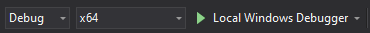
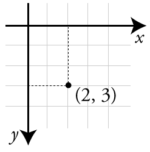
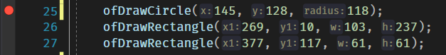
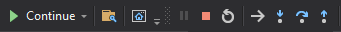
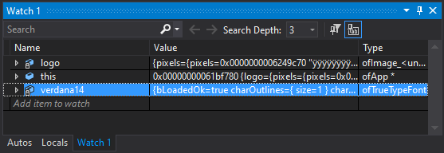

<!-- prettier-ignore-start -->

# openFrameworks Basics 
{: .no_toc }

{: .small .inline}

openFrameworks is an open-source C++ toolkit for creative coding.

This module is an introduction to installing and using this powerful toolkit to create computational artwork.

## Table of Contents
{: .no_toc }

1. TOC
{:toc}

<!-- prettier-ignore-end -->

## Introducing oF

openFrameworks is an open source toolkit designed for creative coding originally created by [Zach Lieberman](http://thesystemis.com/), [Theo Watson](https://theowatson.com/), [Arturo Castro](https://arturocastro.net/), and other members of the openFrameworks community.

openFrameworks is written in C++ and built on top of OpenGL (and [a handful of other libraries](https://openframeworks.cc/about/)). Programs written using openFrameworks run on Microsoft Windows, macOS, Linux, iOS, Android, and Emscripten (Web).

openFrameworks is used by computational artists worldwide to create and inspire.

## Objectives

Upon completion of this module, you should be able to:

- Install openFrameworks for use with Visual Studio 2019.
- Create new oF projects using the Project Generator.
- Describe the purpose of the setup, update, and draw methods.
- Resize the drawing canvas and query for the canvas height/width.
- Draw 2D shapes to the canvas in a variety of colours.
- Change how the background is cleared before each frame.
- Translate, rotate, scale, save, and restore the 2D coordinate system.
- Display images to the canvas.
- Respond to keyboard and mouse events.
- Display text to the debugging console and to the canvas.

## Installing openFrameworks

In this course we'll be using the Windows version of openFrameworks for Microsoft's Visual Studio.

To begin you should [download the visual studio (2017) version of the framework here](https://openframeworks.cc/download/), and unzip it to folder on your machine.

You will also need to have the [Community Edition of Visual Studio](https://visualstudio.microsoft.com/vs/community/) installed, with the following "workloads" configured:

- Desktop Development with C++
- Universal Windows Platform Development
- Game Development with C++

## Creating a New Project

{: .medium .inline}

openFrameworks includes a project generator in the `projectGenerator-vs` folder. This is a stand-alone application that will build your initial Visual Studio project for you.

When you first run the project generator, click the gear icon and specific the folder where openFrameworks has been unzipped. This will ensure the `Project Path` is set properly.

For example, if the oF path is `D:\repos\of_v0.11.0_vs2017` then the `Project Path` will start with `D:\repos\of_v0.11.0_vs2017\apps\myApps`.

The project generator can also add additional "Addon" libraries to your project.

## Folder Structure

Here's a brief overview of the important folders in a Visual Studio openFrameworks project:

- Project Root: Visual Studio Solution and Project Files.
- `src/`: Your `.cpp` and `.h` files.
- `bin/`: Your debug and release executables and required `.dll` libraries.
- `bin/data`: Any data files required by your application.

## Hello World Using openFrameworks

Use the project generator to create a new oF project called `helloOpenFrameworks` with no additional "Addons" specified. Once the project is created, hit the `Open in IDE` button to open it in Visual Studio.

On opening the project Visual Studio should prompt you to "Retarget Projects" to the latest installed version of the Windows SDK and Platform Toolset. Click OK. If this doesn't happen automatically, you can force the conversion by going to the `Project` menu and selecting `Retarget Solution`.

Next, ensure that the `Solutions Platforms` dropdown is set to `x64`. You should now be able to build and run the project by clicking on the play button.



Your program should run without errors displaying a grey window.

In the Visual Studio "Solution Explorer" open the `ofApp.cpp` file in the `src` folder, and change the `setup` and `draw` methods to the following:

```cpp
void ofApp::setup() {
    ofSetWindowTitle("Hello openFrameworks!"); // Set the window title.
    ofSetWindowShape(510, 255); // Set the width and height of the window.
    ofSetCircleResolution(80); // Ensure that circles are smooth.
}

void ofApp::draw(){
    // Set the red and blue component of the logo color using the mouse position.
    ofSetColor(255 - ofGetMouseX() / 2, 0, 255 - ofGetMouseY());
    // Draw the oF logo using a circle, two rectangles, and a triangle.
    ofDrawCircle(145, 128, 118);
    ofDrawRectangle(269, 10, 103, 237);
    ofDrawRectangle(377, 117, 61, 61);
    ofDrawTriangle(377, 10, 377, 111, 479, 10);
}
```

Run the program again and you should be presented with the openFrameworks logo. Hover your mouse over the logo to change the color. 😊

## Setup / Update / Draw

At the heart of every openFrameworks application are the `setup`, `update` and `draw` methods.

- `ofApp::setup()` is run once at the start of the program and never again.
- `ofApp::update()` is run once per frame, allowing us to update the state of our application.
- `ofApp::draw()` is run once per frame (after `update`) and should include all graphical output.

The speed at which oF will attemp to call the `draw` method is controlled by setting the target framerate by calling `ofSetFrameRate()` in `setup`.

## The Canvas

{: .medium .inline}

When working in 2D, the canvas can be consider to be a 2D grid of pixels. This is similar to the x/y cartesian coordinates used in high-school algebra, but with a few changes:

- The origin (where x and y are zero) is in the top left corner of the screen.
- The y-axis is flipped such that values of y increase as you go down the screen.

The image to the right shows a dot at `x = 2` and `y = 3`.

## Canvas Size

By default the size of the canvas is 1024 (width) by 768 (height). The size of the canvas can be changed by resizing the application window, or in the `main.cpp` file:

```cpp
ofSetupOpenGL(1024, 768, OF_WINDOW); // 1024x768 Windowed
ofSetupOpenGL(1024, 768, OF_FULLSCREEN); // 1024x768 Full Screen
```

The size and position of the canvas can also be changed from within `ofApp:setup()`:

```cpp
ofSetWindowShape(500, 500);
ofSetWindowPosition(10, 10);
```

Because the canvas can be resized while your app is running, there are methods to fetch the current width and height:

```cpp
int width = ofGetWidth();
int height = ofGetHeight();
```

## Drawing 2D Shapes

There are a number of methods that allow you to draw 2D shapes to the canvas like:

- [ofDrawLine()](https://openframeworks.cc//documentation/graphics/ofGraphics/#!show_ofDrawLine)
- [ofDrawCircle()](https://openframeworks.cc//documentation/graphics/ofGraphics/#!show_ofDrawCircle) with [ofSetCircleResolution()](https://openframeworks.cc/documentation/graphics/ofGraphics/#show_ofSetCircleResolution)
- [ofDrawEllipse()](https://openframeworks.cc//documentation/graphics/ofGraphics/#!show_ofDrawEllipse)
- [ofDrawRectangle()](https://openframeworks.cc//documentation/graphics/ofGraphics/#!show_ofDrawRectangle) with [ofSetRectMode()](https://openframeworks.cc/documentation/graphics/ofGraphics/#show_ofSetRectMode)
- [ofDrawRectRounded()](https://openframeworks.cc//documentation/graphics/ofGraphics/#!show_ofDrawRectRounded)
- [ofDrawTriangle()](https://openframeworks.cc//documentation/graphics/ofGraphics/#!show_ofDrawTriangle)

Custom shapes can also be drawn using `ofPolyLine` and `ofPath`. [See the ofBook chapter on Advanced Graphics for more details](http://openframeworks.kr/ofBook/chapters/advanced_graphics.html).

### Resources

- 📺 [2D Shapes Tutorial - Lewis Lepton on YouTube](https://www.youtube.com/watch?v=MefIqbEXMFs&list=PL4neAtv21WOlqpDzGqbGM_WN2hc5ZaVv7&index=4) (9m04s)
- 📺 [3D Shapes Tutorial - Lewis Lepton on YouTube](https://www.youtube.com/watch?v=ZNH8LvIhbMc&list=PL4neAtv21WOlqpDzGqbGM_WN2hc5ZaVv7&index=5) (6m33s)

## Drawing Lines in 2D

To be written.

### Resources

- 📺 [Smooth Lines Tutorial - Lewis Lepton on YouTube](https://www.youtube.com/watch?v=pkx9SwXxDXU&list=PL4neAtv21WOlqpDzGqbGM_WN2hc5ZaVv7&index=16) (5m47s)

## Shape Colour

The color of the shapes you draw is set using the [ofSetColor()](https://openframeworks.cc/documentation/graphics/ofGraphics/#show_ofSetColor):

```cpp
ofSetColor(200); // Greyscale color from 0 (black) to 255 (white).
ofSetColor(255, 0, 0); // R, G, B values from 0 to 255.
```

Alpha blending can be enabled to create colours with a 0-255 level of transparency, where 0 is fully transparent and 255 is fully opaque.

```cpp
ofEnableAlphaBlending(); // With Alpha Blending enable we can make transparent colours.
ofSetColor(255,0,0,127); // Red, 50% transparent
ofDrawRectangle(20,20,100,100);
ofDisableAlphaBlending(); // Disable if you don't need alpha any more.
```

### Resources

- 📺 [Color Tutorial - Lewis Lepton on YouTube](https://www.youtube.com/watch?v=phjAR40MIjQ&list=PL4neAtv21WOlqpDzGqbGM_WN2hc5ZaVv7&index=7) (4m35s)

## ofColor Class

There's also an [`ofColor` data type](https://openframeworks.cc///documentation/types/ofColor/), which includes a bunch of predefined colors:

```cpp
// ofColor object configured using r/g/b properties:
ofColor red;
red.r=255;
red.g=0;
red.b=0;
ofSetColor(red);
// ofColor created using a constructor:
ofColor green(0, 255, 0, 255);
ofSetColor(green);
// Using a pre-defined color by name:
ofSetColor(ofColor::fuchsia);
```

There much more to `ofColor` like lerping, inverting colors, or working in the HSB color space. [See the official `ofColor` docs for more details](https://openframeworks.cc/documentation/types/ofColor/).

## Shape Fill

By default, all shapes are drawn filled in, but this can be disable/enable.

```cpp
ofSetColor(0,0,255);
ofNoFill();
ofDrawRectangle(10,10,100,100);  //draws only the rectangle outline in blue
ofFill();
ofDrawRectangle(200,200,100,100);  //draws the rectangle filled in blue
```

## Background Colour

The canvas is automatically cleared with a background color once each frame before the `draw()` method is called. The background color can be set using:

```cpp
ofBackground(50); // Greyscale from black (0) to white (255)
ofBackground(50, 200); // Greyscale with alpha channel
ofBackground(ofColor::blue); // Using an ofColor
ofBackrground(50, 90, 200, 255); // R, G, B, A (0-255)
```

A gradient background can also be set:

```cpp
ofColor colorOne(255, 0, 0);
ofColor colorTwo(0, 0, 255);
// Circular gradient from red (inner) to blue (outer).
ofBackgroundGradient(colorOne, colorTwo, OF_GRADIENT_CIRCULAR);
// Linear gradient from red (top) to blue (bottom).
ofBackgroundGradient(colorOne, colorTwo, OF_GRADIENT_LINEAR);
// Three part linear gradient from red (top) to blue (middle) back to red (bottom).
ofBackgroundGradient(colorOne, colorTwo, OF_GRADIENT_BAR);
```

Sometimes you don't want the background to automatically clear. The automatic clearing can be disabled/enabled like this:

```cpp
ofSetBackgroundAuto(false); // Disable automatic background clearing.
ofSetBackgroundAuto(true); // Enable automatic background clearing.
```

## Translation, Rotation, and Scaling

We can change the position, scale, and rotation of the coordinate system using a variety of translate and rotate methods.

```cpp
ofTranslate(200, 200, 0); // Move the origin to (200, 200)
ofRotateZDeg(45); // Rotate coordinate system by 45 degree (around z)
ofDrawRectangle(0, 0, 100, 100); // Draw a diamond.
```

We can also save and restore the state of the coordinate system using `ofPushMatrix()` and `ofPopMatrix()`.

```cpp
ofPushMatrix(); // Save the original unrotated coordinate system with origin top left.
ofTranslate(200, 200, 0); // Move the origin to (200, 200)
ofRotateZDeg(45); // Rotate coordinate system by 45 degree (around z)
ofScale(2, 2); // Double the scale.
ofDrawRectangle(0, 0, 100, 100); // Draw a diamond.
ofPopMatrix(); // Restore the original coordinate system.
ofDrawRectangle(0, 0, 100, 100); // Draw a square in the top left corner.
```

### Resources

- 📺 [Translate Tutorial - Lewis Lepton on YouTube](https://www.youtube.com/watch?v=1KfihADxxsI&list=PL4neAtv21WOlqpDzGqbGM_WN2hc5ZaVv7&index=6) (4m34s)
- 📺 [Rotation Tutorial - Lewis Lepton on YouTube](https://www.youtube.com/watch?v=wM4gdiJXeIE&list=PL4neAtv21WOlqpDzGqbGM_WN2hc5ZaVv7&index=21) (6m53s)

## Mouse Position and Input

The current x/y location of the mouse can be retrieved as follows:

```cpp
int mouseX = ofGetMouseX();
int mouseY = ofGetMouseY();
```

If you look through the `ofApp.cpp` and `ofApp.h` files you will see a number of predefined methods you can use to respond to mouse events as they happen:

- `void mouseMoved(int x, int y );`
- `void mouseDragged(int x, int y, int button);`
- `void mousePressed(int x, int y, int button);`
- `void mouseReleased(int x, int y, int button);`
- `void mouseEntered(int x, int y);`
- `void mouseExited(int x, int y);`

The value of the `button` parameter will be:

- `0` if the left button is pressed.
- `1` if the center button/wheel is pressed.
- `2` if the right button is pressed.

More details on these callbacks and their touch event equivalents can be seen in the [`ofBaseApp` documentation](https://openframeworks.cc/documentation/application/ofBaseApp/).

### Resources

- 📺 [Mouse Tutorial - Lewis Lepton on YouTube](https://www.youtube.com/watch?v=RFr5cM4m5XA&list=PL4neAtv21WOlqpDzGqbGM_WN2hc5ZaVv7&index=15) (5m04s)

## Keyboard Events

There are similar `keyPressed(int key)` and `keyReleased(int key)` callbacks available to handle keyboard events.

The `key` parameter can be compared with specific characters:

```cpp
void keyPressed(int key){
    if (key == 't'){
        // The t key was pressed.
    } else if (key == ' '){
        // The spacebar was pressed.
    }
}
```

There are constants available to test for the arrow keys, backspace, return, and other special non-character keys: `OF_KEY_BACKSPACE`, `OF_KEY_RETURN`, `OF_KEY_PRINTSCR`, `OF_KEY_F1` to `OF_KEY_F12`, `OF_KEY_LEFT`, `OF_KEY_UP`, `OF_KEY_RIGHT`, `OF_KEY_DOWN`, `OF_KEY_PAGE_UP`, `OF_KEY_PAGE_DOWN`, `OF_KEY_HOME`, `OF_KEY_END`, `OF_KEY_INSERT`

### Resources

- 📺 [Keyboard Tutorial - Lewis Lepton on YouTube](https://www.youtube.com/watch?v=3DHpmJAzas4&list=PL4neAtv21WOlqpDzGqbGM_WN2hc5ZaVv7&index=14) (5m57s)

## Persistent Variables

The variables we've dealt with so far have been function parameters and local variables, both of which go out of scope after each frame. To preserve state across frames we can add `private` properties to the ofApp class as defined in the `ofApp.h` header file.

Primitive properties will be initially assigned zero, but can be manually assigned a value in `setup()`. Properties that are class-based will be constructed using their default constructor, but can also be assigned an initial state in `setup()`.

The next two sections will give us the opportunity to work with some `private` properties.

## Loading Images

openFrameworks wraps the [FreeImage](https://freeimage.sourceforge.io/) library allowing us to load, display, resize, and manipulate images in formats like png, jpg, gif, bmp, tiff, and others.

In your project's `ofApp.h` file below the method definitions:

```cpp
private:
    ofImage freakyGoatGhost;
```

In the associated `ofApp.cpp` file, with `setup()`:

```cpp
// Place image file in the "bin/data/" folder:
freakyGoatGhost.load("freaky_goat_ghost.png");
// Or load from a URL:
freakyGoatGhost.load("http://example.com/freaky_goat_ghost.png");
```

Draw and resize within `draw()`:

```cpp
freakyGoatGhost.draw(10, 50); // Top left corner at x = 10 and y = 50
freakyGoatGhost.draw(100, 100, 50, 90); // Drawn at (100,100) resized to 50 width and 90 heights.
```

### Resources

- 📺 [Image Tutorial - Lewis Lepton on YouTube](https://www.youtube.com/watch?v=OLLtdyJC_Zs&list=PL4neAtv21WOlqpDzGqbGM_WN2hc5ZaVv7&index=8) (6m04s)

## Processing Image Pixels

The color and brightness of any image pixel can be retrieved:

```cpp
ofColor colorAtXY = freakyGoatGhost.getColor(30, 90); // The colour at x = 30 and y = 90
float brightnessAtXY = colorAtXY.getBrightness();
```

The ofBook contains [a great chapter on computer vision and the sorts of low-level things you can do with image pixels](https://openframeworks.cc/ofBook/chapters/image_processing_computer_vision.html).

## Simple Text

We can draw simple debugging messages to the screen at a set font size using:

```cpp
// Using the current color set by `ofSetColor()`:
ofDrawBitmapString("Hello Whirled", 100, 200); // Write text to x = 100, y = 200.
// White text on black background.
ofDrawBitmapStringHighlight("Hello Whirled", 100, 120);
// Blue text on yellow background.
ofDrawBitmapStringHighlight("Hello Whirled", 100, 140, ofColor::yellow, ofColor::blue);
```

### Resources

- 📺 [Text Tutorial - Lewis Lepton on YouTube](https://www.youtube.com/watch?v=0grroKrKI1I&list=PL4neAtv21WOlqpDzGqbGM_WN2hc5ZaVv7&index=9) (2m31s)

## Text and Fonts

To draw text of any size we need to use a TrueType font.

Grab a font from your `c:\windows\fonts` folder a put it in the `bin\data` folder. For the sake of example, let's say you grabbed `verdana.ttf`.

In your project's `ofApp.h` file below the method definitions:

```cpp
private:
    ofTrueTypeFont	verdanaText;
```

In the associated `ofApp.cpp` file, with `setup()`:

```cpp
ofTrueTypeFont::setGlobalDpi(72); // Default is 96, but results in larger than normal pt size.
verdanaText.load("verdana.ttf", 14, true, true); // filename, point size, antialiased boolean, full char-set boolean
verdanaText.setLineHeight(18.0); // Default is based on font size.
verdanaText.setLetterSpacing(1.05); // Default is based on font size.
```

And then within `draw()`:

```cpp
verdanatText.drawString("Hello Squirrel", 50, 100); // Output text at x = 50, y = 100
```

More details in [the official `ofTrueTypeFont` documentation](https://openframeworks.cc/documentation/graphics/ofTrueTypeFont/).

### Resources

- 📺 [Text Font Tutorial - Lewis Lepton on YouTube](https://www.youtube.com/watch?v=6pecyHuP75Q&list=PL4neAtv21WOlqpDzGqbGM_WN2hc5ZaVv7&index=10) (5m21s)

## Debugging openFramework Applications

**cout debugging**

The easiest way to quickly debug a sketch is to use `cout` to output the state of your variables to the terminal window that opens along with your sketch.

Downsides: The output can be overwhelming and will slow down your sketch.

**drawString debugging**

This is similar to `cout` debuggging, but instead you use a true type font to draw the state of certain variables to the screen.

Downsides: Variables state output in this way will be overwritten every frame.

**breakdown debugging**

You can add one or more breakpoints by clicking in the breakpoint column to the left of your code. The breakpoints will show as red circles and can be clicked again to be removed.



The execution of your code will now pause when a breakpoint is reached. You can then step into (F11), step over (F10), and step out (Shift-F11) to walk through your code line by line. There are buttons for these step-types as well:



The state of local variables is shown below. You can add your own variables to watch as well.



### Resources

- [First Look at the Visual Studio Debugger](https://docs.microsoft.com/en-us/visualstudio/debugger/debugger-feature-tour)
- [Learn to debug C++ code using Visual Studio](https://docs.microsoft.com/en-us/visualstudio/debugger/getting-started-with-the-debugger-cpp)

## oF Add Ons

To be written. :)

### Resources

- 📺 [Project Generator and Addons Tutorial - Lewis Lepton on YouTube](https://www.youtube.com/watch?v=sgU_r4Kn_rk&list=PL4neAtv21WOlqpDzGqbGM_WN2hc5ZaVv7&index=3) (5m47s)

## Other Handy Utility Classes

There's so much more to openFrameworks! You can start by exploring these handy classes:

- [`ofRectangle`](https://openframeworks.cc/documentation/types/ofRectangle/) - Super handy for simple collision detection hit boxes.
- [`ofDirectory`](https://openframeworks.cc/documentation/utils/ofDirectory/), [`ofFilePath`](https://openframeworks.cc/documentation/utils/ofFilePath/) and [`ofFile`](https://openframeworks.cc/documentation/utils/ofFile/) - For working with files.
- [`ofURLFileLoader`](https://openframeworks.cc///documentation/utils/ofURLFileLoader/) - For loading data from URLs.
- [And many more!](https://openframeworks.cc/documentation/)

## Example Code to Study

You'll find two example programs below, but there are lots of examples out there you can learn from:

- [Official openFrameworks Example](https://github.com/openframeworks/openFrameworks/tree/master/examples) - There are also found in the `examples` folder of the openFrameworks zip file.
- [Cookbook of Common Tasks from ofAuckland](https://sites.google.com/site/ofauckland/examples)
- [Example Source from Mastering openFrameworks Book](https://github.com/firmread/ofDemystified)
- [Lewis Lepton's 76 Video openFrameworks YouTube series](https://www.youtube.com/playlist?list=PL4neAtv21WOlqpDzGqbGM_WN2hc5ZaVv7) and [the associated github repo](https://github.com/lewislepton/openFrameworksTutorialSeries).
- Dan Buzzo's [openFrameworks superBasics YouTube series](https://www.youtube.com/playlist?list=PL6QF0yo3Zj7DbN76C5-_6VCDF5CPBIz6l) and [his many other playlists](https://www.youtube.com/c/danbuzzo/featured).

## Example Sketch One - Mouse Trails

Manually clearing the background with an alpha channel to create some mouse trails:

```cpp
void ofApp::setup(){
    ofSetBackgroundAuto(false); // Disable automatic background clearing.
    ofEnableAlphaBlending();    // Allow alpha channel transparency.
    ofSetCircleResolution(50);  // Make circles smoother than the default.
    ofSetFrameRate(60);         // Set the framerate to 60 frames per second.
}

void ofApp::draw(){
    ofSetColor(0, 0, 0, 10); // Set the fill color to black with a low alpha value.
    ofDrawRectangle(0, 0, ofGetWidth(), ofGetHeight()); // Draw a rectangle that covers the canvas.
    ofSetColor(255, 255, 255, 255); // Set the fill color to white with full alpha.
    ofDrawCircle(ofGetMouseX(), ofGetMouseY(), 30); // Draw circle at the mouse position.
}
```

## Example Sketch Two - Twisted Squares

Scaling and rotation of a circle controlled by the mouse position:

```cpp
void ofApp::setup(){
    ofSetFrameRate(60); // Set frame rate to 60 FPS.
    ofSetRectMode(OF_RECTMODE_CENTER); // Rectangle x/y positions specify the shape's center.
    ofNoFill(); // Don't fill shapes.
}

void ofApp::draw(){
    // Pink and blue circular background gradient.
    ofBackgroundGradient(ofColor::deepPink, ofColor::deepSkyBlue, OF_GRADIENT_CIRCULAR);

    // Translate the coordinate system to the middle of the canvas.
    ofTranslate(ofGetWidth() / 2, ofGetHeight() / 2);

    // Draw 100 circles of increasing size and rotation.
    for (auto i = 0; i < 100; ++i) {
        // Use the x position of the mouse to set the rotation.
        ofRotateZDeg((double)ofGetMouseX() / 50);
        // Use the y position of the mouse to set the scaling.
        double scaleFactor = 1 + (double)ofGetMouseY() / (double)ofGetHeight() / 5;
        ofScale(scaleFactor, scaleFactor);
        // Draw the rotated and scaled square.
        ofDrawRectangle(0, 0, 1, 1);
    }
}
```

## Further Reading

- [openFrameworks Forums](https://forum.openframeworks.cc/) - Sign Up ASAP :)
- [API Documentation @ openframeworks.cc](https://openframeworks.cc/documentation/)
- [How-Tos @ openframeworks.cc](https://openframeworks.cc/learning/)
- [The ofBook @ openframeworks.cc](https://openframeworks.cc/ofBook/chapters/foreword.html)
- [openFramworks Github Repo](https://github.com/openframeworks/)
