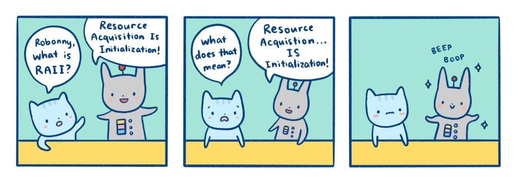

<!-- prettier-ignore-start -->

# Classes
{: .no_toc }

Objects in C++ are data structures with state and member functions. We can think of a `class` as a blueprint to define the structure and behaviour of an instantiated object.

## Table of Contents
{: .no_toc }

1. TOC
{:toc}

<!-- prettier-ignore-end -->

## Difference From Structs

Let's start by reiterating what was said at the end of the `struct` section:

The only difference between a `struct` and a `class` is the default for member visibility:

- `struct` members are public by default.
- `class` members are private by default.

💡 Best Practice:
{: .label .label-green }

Use `struct` for data-only structures and `class` for objects with data and behaviours.
{: .d-inline-block}

## Defining a Class

Let's start to define a class to represent a calendar date:

```cpp
class Date {
  int year;
  int month;
  int day;
};
```

⚡ Warning:
{: .label .label-red}

Don't forget the semicolon after the closing curly brace.
{: .d-inline-block}

## Initializing Class Members

Because the member variables are private we cannot (yet) use an initializer list to create an object of type `Date`:

```cpp
Date birthday{ 1977, 9, 27 }; // Error! No matching constructor.
```

We can, however, give the members default values:

```cpp
class Date {
  int year{ 1 };
  int month{ 1 };
  int day{ 1 };
};

// Later in the program:
Date birthday{}; // Ok: Internally day, month, year all set to 1.
```

🎵 Note:
{: .label .label-yellow}

Classes without constructors are provided zero-argument default constructors.
{: .d-inline-block}

## Constructors

In order to initialize private member variables when constructing an object we need one (or more) special functions called _constructors_.

Constructors are named after the class and have no return type:

```cpp
class Date {
  int year{ 1 };
  int month{ 1 };
  int day{ 1 };

public:
  Date(int y, int m, int d)
  {
    year = y;
    month = m;
    day = d;
  }
```

🎵 Note:
{: .label .label-yellow}

Class members are private by default. We use `public:` to allow access to the constructor.
{: .d-inline-block}

## Member Initializers

A more modern way to define the constructor would be to use member initializers to initialize our three member variables.

```cpp
class Date {
  int year;
  int month;
  int day;

public:
  Date(int y, int m, int d)
      : year{y}, month{m}, day{d} // member initializers.
  {
    // Constructor body empty as member initializers did all the work.
  }
};

// Later in the program:
Date birthday{ 1977, 9, 27 }; // Works now!
```

## Default Constructors

With our new constructor in place our class will no longer have an implicit default constructor:

```cpp
Date birthday{}; // Error! No matching constructor.
```

This can be fixed by requesting a default constructor:

```cpp
class Date {
  int year; // Uninitialized properties are set to 0.
  int month;
  int day;

public:
  Date(int y, int m, int d)
      : year{y}, month{m}, day{d}
  { }

  Date() = default;
};

// Later in the program:
Date birthday{}; // Works again! But all properties default to zero if uninitialized.
```

## Overloaded Constructors

[Just like other functions](/Programming-1-Notes/docs/05-introduction-to-cpp/08-function-basics.html#function-overloading), contructors can be overloaded:

```cpp
class Date {
  // Let's put back in the defaults through initialization.
  int year{ 1 };
  int month{ 1 };
  int day{ 1 };

public:
  Date(int y, int m, int d) // Three argument constructor.
      : year{y}, month{m}, day{d}
  { }

  Date(int y) // Year only, one argument constructor.
      : year{y}
  { }

  Date() = default;
};

// Later in the program:
Date defaultDate{}; // Internally: year = 1, month = 1, day = 1
Date JanFirstInTheFuture{ 3000 }; // Internally: year = 3000, month = 1, day = 1
Date SeptSecondInTheFuture{ 300, 9, 2 }; // Internally: year = 3000, month = 9, day = 2
```

## Defining Member Functions

We can add other functions to the class that use the private member variables.

Here's the `Date` class again, but simplified to have only one constructor. A `public` debugging function has been added:

```cpp
class Date {
  int year{ 1 };
  int month{ 1 };
  int day{ 1 };

public:
  Date(int y, int m, int d)
      : year{y}, month{m}, day{d}
  { }

  void debugPrint() {
    std::cout << "Y:" << year << " M:" << month << " D:" << day << "\n";
  }
};

// Later in the program:
 Date birthday{ 1977, 9, 27 };
 birthday.debugPrint(); // Outputs: Y:1977 M:9 D:27
```

## Fetching and Modifying Class Members

If you need to break [encapsulation](https://www.learncpp.com/cpp-tutorial/access-functions-and-encapsulation/) and provide getters and setters for private members variables, it's common to prefix the member names with a lowercase `m` or `m_`:

```cpp
class Date {
  int mYear{1};
  int mMonth{1};
  int mDay{1};

public:
  Date(int y, int m, int d)
    : mYear{y}, mMonth{m}, mDay{d}
  {  }

  int year() { // Trivial Getter
    return mYear;
  }

  void year(int y) { // Trivial Setter
    mYear = y;
  }

  void debugPrint() {
    std::cout << "Y:" << mYear << " M:" << mMonth << " D:" << mDay << "\n";
  }
};

// Later in the code:
 Date birthday{ 1, 9, 1977 };
 std::cout << birthday.year() << "\n"; // Outputs: 1
 birthday.year(1977);
 birthday.debugPrint(); // Outputs: Y:1977 M:9 D:27
```

💡 Best Practice:
{: .label .label-green }

The C++ Code Guidelines [warn against "trivial getters and setters"](https://isocpp.github.io/CppCoreGuidelines/CppCoreGuidelines#c131-avoid-trivial-getters-and-setters).
{: .d-inline-block}

## Public vs Private vs Protected Access

We've seen how the `public:` access specifier can make member functions accessible from outside the class. There are actually three access specifiers we can use:

- `public:` - Members are accessible from outside the class.
- `private:` - Members cannot be accessed from outside the class. (Default)
- `protected:` - Members cannot be accessed from the outside, but can be accessed in inherited classes.

## Destructors

Class destructors are called when an object is destroyed. This usually happens when a variable goes out of scope. Destructors are named after the class with a tilde `~` prefix. They take no arguments and have no return type.

Here's a class with a constructor and destructor that announce their own execution:

```cpp
#include <iostream>
#include <string>

class LoudMouth {
  public:
  LoudMouth(std::string n)
    : name{n} {
    std::cout << "  📣  Constructor: " << name << "\n";
  }

  ~LoudMouth() {
    std::cout << "  📣  Destructor: " << name << "\n";
  }

  private:
  std::string name;
};

int main() {
  std::cout << "Program main() begins.\n";
  LoudMouth wally{ "Wally" };

  if (1 == 1) { // Useless test to create a nested scope.
    std::cout << "  If scope begins.\n  ";
    LoudMouth daisy{ "Daisy" };
    std::cout << "  If scope ends.\n  ";
  }

  std::cout << "Program main() ends.\n";
}
```

## RAII - Resource Acquisition is Initialization

Constructors and destructors allow for the popular resource management technique [RAII](https://en.cppreference.com/w/cpp/language/raii), where the life-cycles of resources (like memory, network sockets, open files, etc) are bound to the lifetime of specific objects.

Said another way, with RAII resources are obtained within class constructors and released in class destructors. This way, resource cleanup is automatically handled when objects go out of scope.

A better name for this technique is Scope-Bound Resource Management (SBRM), but RAII is the term everyone seems to use.



⏳ Wait For It:
{: .label .label-blue}

We'll see RAII in action when we get to [the pointers and objects module](/Programming-1-Notes/docs/11-pointers/04-pointers-and-objects.html).
{: .d-inline-block}

## Static Members Variables and Functions

Members and functions can be made to belong to the class (rather than to an instance of the class) using the `static` keyword.

```cpp
#include <iostream>

class Widget {
  public:
    Widget() {
      mId = ++sWidgetsMade;
    }

    static int numberOfWidgetsMade() {
      return sWidgetsMade;
    }

    int id() {
      return mId;
    }

  private:
  static int sWidgetsMade;
  int mId;
};

// Non-const static members must be initialized outside the class.
int Widget::sWidgetsMade{ 0 }; 

int main() {
  std::cout << "Current number of Widgets: " << Widget::numberOfWidgetsMade() << "\n";
  Widget A;
  Widget B;
  std::cout << "Current number of Widgets: " << Widget::numberOfWidgetsMade() << "\n";
  std::cout << "The id of widget A: " << A.id() << "\n";
  std::cout << "The id of widget B: " << B.id() << "\n";
}
```

## Const Objects

[Recall](/docs/05-introduction-to-cpp/03-data-types-variables-constants.html#constants) that we can mark variables as `const` to have the compiler ensure they are never modified once initialized.

Objects can also be made `const`, which will ensure that none of their member variables can change. Let's return to our example `Date` class:

```cpp
#include <iostream>

class Date {
  int mYear;
  int mMonth;
  int mDay;

public:
  Date(int y, int m, int d)
    : mYear{y}, mMonth{m}, mDay{d}
  {  }

  int year() const { // Trivial Getter. Function marked as const.
    return mYear;
  }

  void year(int y) { // Trivial Setter.
    mYear = y;
  }

  void debugPrint() const { // Function marked as const.
    std::cout << "Y:" << mYear << " M:" << mMonth << " D:" << mDay << "\n";
  }
};

int main() {
  Date mutableDate{ 2021, 01, 01 };
  const Date immutableDate{ 2021, 12, 31 };

  mutableDate.debugPrint();
  immutableDate.debugPrint();

  // Attempt to change member variables via setter:
  mutableDate.year(400); // Okay.
  immutableDate.year(400); // Compiler error.
}
```

🎵 Note:
{: .label .label-yellow}

Public member variables of a `const` object also cannot be changed.
{: .d-inline-block}

## Const Member Functions

Class member functions that do not change the state of any member variables can also be marked as `const`. When marking a function as `const` the keyword comes after the function signature.

If you look at the `Date` code in the previous section you'll see that two of the member functions are marked as `const`. When an object is marked as `const`, we can only call `const` member functions on that object. Try removing the `const` from the `debugPrint` function and you'll see that the compiler will prevent you from calling this function on the `immutableDate` object.

## This Pointer

Like other object oriented languages, C++ objects have a hidden `this` variable to provide an internal self-reference to the object.

You will rarely (if ever) need to make use of `this` directly, although you might see legacy code using `this` to disambiguate class member variables from method parameters of the same name:

```cpp
class Widget {
public:
  Widget(int id) {
    this->id = id; // this->id is the member, while id is the parameter.
  }
private:
  int id;
}
```

🎵 Note:
{: .label .label-yellow}

The `->` operator is used to reference members via `this`.
{: .d-inline-block}

## Header Class Definition and CPP Class Implementations

Up to this point we've been defining the class and its implementation within the `main.cpp` but it's more common to define a class within a `.h` header file, with its implementation defined in a separate `.cpp` file.

When defining methods in the `.cpp` file we must prefix the method name with `Classname::` where `Classname` is the actual name of the class.

<iframe height="600px" width="100%" src="https://replit.com/@stungeye/Separate-Cpp-and-Header-Files?lite=true" scrolling="no" frameborder="no" allowtransparency="true" allowfullscreen="true" sandbox="allow-forms allow-pointer-lock allow-popups allow-same-origin allow-scripts allow-modals"></iframe>

🎵 Note:
{: .label .label-yellow}

Use the 📄 file icon above to toggle the file explorer to see `date.h` and `data.cpp`.
{: .d-inline-block}

## Object Oriented Inheritance

In object-oriented programming, we can create classes that _inherit_ members from existing classes. In C++ we say that the _derived_ class inherits from a _base_ class. In other programming languages we might say that a child class (or sub class) inherits from a parent class (or super class).

Imagine a `Character` class which is the _base_ class of two _derived_ classes, `PlayerCharacter` and `AICharacter`.

```cpp
  PlayerCharacter hero{"Daisy Glutton"};
  AICharacter helper{"Wally Glutton"};
```

Inheritance describes an _is-a_ relationship:

- The `hero` object _is-a_ `PlayerCharacter` and it also _is-a_ `Character`.
- The `helper` object _is-a_ `AICharacter` and it also _is-a_ `Character`.

Through this relationship, the _derived_ class inherits access to the `public` and `protected` members of the _base_ class.

## Simple Inheritance

Let's do a quick overview of the basics of C++ inheritance with an example of a `Student` class derived from a `Person` class.

```cpp
#include <iostream>
#include <string>

class Person {
public: 
  Person(std::string name, int age) // Person constructor
        : mName{name}, mAge{age}    // Member variable initializers
  { }

  // Defined in the base class only but available to derived class.
  void greetings() { 
    std::cout << "Hello, my name is " + mName + ".\n";
  }

  // Defined in both the base class and the derived class.
  std::string debugMessage() { 
    return "name: " + mName + " age: " + std::to_string(mAge);
  }

protected: // Protected members will be accessible to the derived class.
  std::string mName;

private: // Private members will not be accessible to the derived class.
  int mAge;
};

class Student : public Person { // Student inherits from Person
public:
  Student(std::string name, int age, double gpa) // Student constructor
         : Person{name, age}, // Base class constructor call
           mGpa{gpa}          // Member initializer
  { }

  // Redefined function which uses base class version of function.
  std::string debugMessage() { 
    return Person::debugMessage() + " GPA: " + std::to_string(mGpa);
  }

  void writeCode() { // Defined only in the derived class.
    std::cout << mName << " sez: All this coding is making me thirsty!\n";
  }

private: // Derived class private members.
  double mGpa;
};

int main() {
  Person coda{ "Coda Forth", 25 };
  Student timbre{ "Timbre Dalfoor", 43, 3.9 };

  // The coda object is-a Person, so we can call Person::greetings().
  coda.greetings();

  // timber is-a Student *and* a Person, so Person::greetings() works too.
  timbre.greetings();

  // The timber oject is-a Student, so we can call Student::writeCode().
  timbre.writeCode();
 
  // We cannot call Student::writeCode() on coda:
  // coda.writeCode(); // Compiler Error: No member named 'writeCode`.

  // Calling .debugMessage() on coda runs Person::debugMessage().
  std::cout << coda.debugMessage() << "\n";

  // Calling .debugMessage() on coda runs Student::debugMessage().
  std::cout << timbre.debugMessage() << "\n";

}
```

💡 Best Practice:
{: .label .label-green}

See [a version of this code with classes defined and implemented in `.h` and `.cpp` files](https://replit.com/@stungeye/Basic-Inheritance-Separate-Files).
{: .d-inline-block}

## Polymorphism To Be Continued

⏳ Wait For It:
{: .label .label-blue}

Subtype polymorphism is covered in our [pointers and polymorphism module](/Programming-1-Notes/docs/11-pointers/05-pointers-and-polymorphism.html).
{: .d-inline-block}

## Further Reading

- [Chapter 11 @ learncpp.com covers basic object-oriented programming with classes](https://www.learncpp.com/)
- Related isocpp.org FAQs:
  - [Classes and Objects FAQ](https://isocpp.org/wiki/faq/classes-and-objects)
  - [Constructors FAQ](https://isocpp.org/wiki/faq/ctors)
  - [Destructors FAQ](https://isocpp.org/wiki/faq/dtors)
  - [Inheritance Basics FAQ](https://isocpp.org/wiki/faq/basics-of-inheritance)
