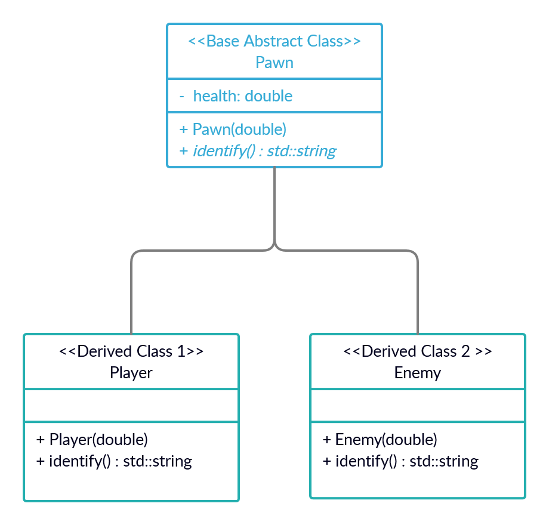

<!-- prettier-ignore-start -->

# Pointers and Polymorphism
{: .no_toc }

Back when we first learned about inheritance, I promised we'd eventually learn about polymorphism in C++. We had to wait until now because of the need for pointers.

## Table of Contents
{: .no_toc }

1. TOC
{:toc}

<!-- prettier-ignore-end -->

## Polymorphism in C++

Some quick OO terms to remember from [our classes module](/Programming-1-Notes/docs/08-user-defined-types/03-classes.html):

- **Base Class** - A class that other classes inherit from. (Often called a _parent class_ in other languages.)
- **Derived class** - A class that inherits from a base class. (Often called a _child class_ in other languages.)
- Derived classes share an interface inherited from their common base class.
- **Subtype Polymorphism** - The ability to use the shared interface of derived classes by way of references or pointers to the base class.

## An Example Hierarchy

Imagine the following simple class hierarchy:

- An abstract base class `Pawn`:
  - One `health` member of type `double`.
  - Simple constructor.
  - Function `std::string identify()`.
- Derived class `Player`:
  - Simple constructor that makes use of parent constructor.
  - Overrides `std::string identify()`.
- Derived class `Enemy`:
  - Simple constructor that makes use of parent constructor.
  - Overrides `std::string identify()`.

## Our Class Diagram

{:class="large"}

## The Polymorphism We Want

The code below shows what we want to be able to do.

Notice that we trigger the polymorphism by way of two overloaded `printPawnId` functions. There's one version that takes a reference to a `Pawn` and another that takes a pointer to a `Pawn`. 

The overloaded functions aren't both required. We've implemented both to demonstrate polymorphism via references and pointers.

```cpp
// Accepts Player or Enemy References:
void printPawnId(const Pawn& p) {
  std::cout << "REF - " << p.identify() << "\n";
}
// Accepts pointers to Player or Enemy object:
void printPawnId(const Pawn* p) {
  std::cout << "PTR - " << p->identify() << "\n";
}

// Elsewhere in the code:
Player wally{90.0};
Enemy  daisy{100.0};

printPawnId(wally);  // Prints: REF - Player here!
printPawnId(daisy);  // Prints: REF - Enemy here!
printPawnId(&wally); // Prints: PTR - Player here!
printPawnId(&daisy); // Prints: PTR - Enemy here!
```

## Naive Incorrect Implementation of Polymorphism

Here's a naive and broken implementation of polymorphism for the `Pawn`, `Player` and `Enemy` class. Notice that when we try to polymorphically call a `Player`'s or `Enemy`'s `identify()` method, the `Pawn` implementation is used instead.

<iframe height="800px" width="100%" src="https://replit.com/@stungeye/Naive-Incorrect-Polymorphism?lite=true#main.cpp" scrolling="no" frameborder="no" allowtransparency="true" allowfullscreen="true" sandbox="allow-forms allow-pointer-lock allow-popups allow-same-origin allow-scripts allow-modals"></iframe>

## Virtual Functions to the Rescue

A virtual function is a special kind of class member function that, when called, executes the _most-derived_ version of that function. For our example code above to work, we will need to make `identify()` a virtual function in the base `Pawn` class. Although not required, we will mark the `identify()` implementations in the derived classes as overrides using the `override` keyword.

If it doesn't make sense to implement a virtual function in the base class, we can mark it as a "pure virtual function" by replacing the implementation block with `= 0`. Classes with one or more pure virtual functions are said to be "abstract" and therefore cannot be constructed.

We'll make the `Pawn` class abstract in this way.

💡 Best Practice:
{: .label .label-green }

Make base class destructors virtual so that derived destructors can be used.
{: .d-inline-block}

## Working Implementation of Polymorphism

<iframe height="800px" width="100%" src="https://replit.com/@stungeye/Polymorphism?lite=true#main.cpp" scrolling="no" frameborder="no" allowtransparency="true" allowfullscreen="true" sandbox="allow-forms allow-pointer-lock allow-popups allow-same-origin allow-scripts allow-modals"></iframe>

## Polymorphism and Containers

Although polymorphism can be implemented using references or pointers, if we also wish to involve containers we need to use pointers. There's no such thing in C++ as a container of references.

Here's an example of polymorphism using a vector along with unique pointers:

<iframe height="800px" width="100%" src="https://replit.com/@stungeye/Containers-and-Polymorphism?lite=true#main.cpp" scrolling="no" frameborder="no" allowtransparency="true" allowfullscreen="true" sandbox="allow-forms allow-pointer-lock allow-popups allow-same-origin allow-scripts allow-modals"></iframe>
