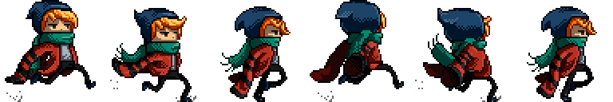

<!-- prettier-ignore-start -->

# Textures and Animation
{: .no_toc }

A texture lets Raylib draw pixel artwork efficiently. This page covers loading, positioning, resizing, tinting, rotation, sprite sheets, and the important difference between an image and a texture.

## Table of Contents
{: .no_toc }

1. TOC
{:toc}

<!-- prettier-ignore-end -->

## Assets and Relative Paths

An **asset** is a file your program uses at run time, such as an image, font, sound, or level file. The examples on this page use [`assets/scarfy.png`](assets/scarfy.png), a six-frame sprite sheet from the official Raylib examples.



Copy the module's `assets` folder into the location expected by your course project. A path such as `"assets/scarfy.png"` is normally interpreted relative to the program's **working directory**, not relative to the `.cpp` source file. In Visual Studio, the working directory depends on how the project is configured and launched.

If an asset does not load, first check the exact path, spelling, capitalization, and working directory. `GetWorkingDirectory()` and `FileExists()` can help:

```cpp
TraceLog(LOG_INFO, "Working directory: %s", GetWorkingDirectory());
TraceLog(LOG_INFO, "Sprite exists: %s",
         FileExists("assets/scarfy.png") ? "yes" : "no");
```

## Images and Textures

Raylib distinguishes between two related types:

- An `Image` stores pixels in normal CPU memory. Use it when you need to generate, resize, crop, or inspect pixel data.
- A `Texture2D` stores image data in graphics memory so the GPU can draw it efficiently.

Most 2D programs should load a file directly as a texture:

```cpp
Texture2D sprite{LoadTexture("assets/scarfy.png")};

// Main loop goes here.

UnloadTexture(sprite);
```

When CPU-side image processing is needed, transfer the result to a texture and release the image once it is no longer needed:

```cpp
Image image{LoadImage("assets/scarfy.png")};
ImageResize(&image, image.width * 2, image.height * 2);

Texture2D texture{LoadTextureFromImage(image)};
UnloadImage(image); // The texture now has its own GPU copy.

// Draw texture in the main loop.

UnloadTexture(texture);
```

An `Image` does not need to remain loaded after `LoadTextureFromImage()`. A `Texture2D` must remain loaded for as long as you draw it.

## Loading Safely

Load textures after `InitWindow()`, because loading a texture requires a graphics context. Check that the result is valid before using it:

```cpp
Texture2D sprite{LoadTexture("assets/scarfy.png")};

if (!IsTextureValid(sprite)) {
    TraceLog(LOG_ERROR, "Could not load assets/scarfy.png");
    CloseWindow();
    return 1;
}
```

Unload every successfully loaded texture before `CloseWindow()`:

```cpp
UnloadTexture(sprite);
CloseWindow();
```

## Drawing, Resizing, and Tinting

The simplest texture call places the texture's top-left corner at an x/y position:

```cpp
DrawTexture(sprite, 40, 70, WHITE);
DrawTextureV(sprite, Vector2{180.0F, 70.0F}, SKYBLUE);
```

The final argument is a tint. `WHITE` leaves the original colours unchanged; another colour multiplies the texture's colour channels. `Fade(WHITE, 0.5F)` draws it at half opacity.

`DrawTextureEx()` adds rotation and scale:

```cpp
DrawTextureEx(sprite, Vector2{300.0F, 120.0F}, 15.0F, 2.0F, WHITE);
```

Scaling while drawing changes its displayed size without altering the texture data.

## Source and Destination Rectangles

`DrawTexturePro()` gives the most control:

```cpp
Rectangle source{0.0F, 0.0F,
                 static_cast<float>(sprite.width),
                 static_cast<float>(sprite.height)};
Rectangle destination{400.0F, 220.0F, 240.0F, 144.0F};
Vector2 origin{destination.width / 2.0F, destination.height / 2.0F};

DrawTexturePro(sprite, source, destination, origin, 20.0F, WHITE);
```

- The **source rectangle** selects pixels from the texture.
- The **destination rectangle** controls the on-screen position and size.
- The **origin** is measured from the destination rectangle's top-left corner and becomes its drawing and rotation pivot.
- The rotation is clockwise in degrees.

The destination's x/y position is where Raylib places the origin. In this example, `(400, 220)` is the centre of the drawn texture.

## Sprite-Sheet Animation

A sprite sheet stores animation frames side by side in one texture. The included `scarfy.png` is 768 pixels wide by 128 pixels high and contains six 128 by 128 pixel frames. We change the source rectangle over time while drawing the same texture.

This complete program animates Scarfy and lets you move left and right:

```cpp
#include "raylib.h"

#include <algorithm>

int main() {
    constexpr int screenWidth{900};
    constexpr int screenHeight{500};
    constexpr int frameCount{6};
    constexpr float frameDuration{0.10F};
    constexpr float movementSpeed{220.0F};
    constexpr float drawingScale{2.0F};

    InitWindow(screenWidth, screenHeight, "Raylib - Sprite Animation");
    SetTargetFPS(60);

    Texture2D sprite{LoadTexture("assets/scarfy.png")};
    if (!IsTextureValid(sprite)) {
        TraceLog(LOG_ERROR, "Could not load assets/scarfy.png");
        CloseWindow();
        return 1;
    }

    const float frameWidth{static_cast<float>(sprite.width) / frameCount};
    const float frameHeight{static_cast<float>(sprite.height)};
    Vector2 position{screenWidth / 2.0F, screenHeight - 85.0F};
    int currentFrame{0};
    float animationTimer{0.0F};
    bool facingRight{true};

    while (!WindowShouldClose()) {
        const float deltaTime{GetFrameTime()};
        float direction{0.0F};

        if (IsKeyDown(KEY_A) || IsKeyDown(KEY_LEFT)) direction -= 1.0F;
        if (IsKeyDown(KEY_D) || IsKeyDown(KEY_RIGHT)) direction += 1.0F;

        if (direction != 0.0F) {
            position.x += direction * movementSpeed * deltaTime;
            facingRight = direction > 0.0F;

            animationTimer += deltaTime;
            while (animationTimer >= frameDuration) {
                animationTimer -= frameDuration;
                currentFrame = (currentFrame + 1) % frameCount;
            }
        } else {
            currentFrame = 0;
            animationTimer = 0.0F;
        }

        const float halfDrawnWidth{frameWidth * drawingScale / 2.0F};
        position.x = std::clamp(position.x, halfDrawnWidth,
                                screenWidth - halfDrawnWidth);

        Rectangle source{
            currentFrame * frameWidth,
            0.0F,
            facingRight ? frameWidth : -frameWidth,
            frameHeight
        };
        Rectangle destination{
            position.x,
            position.y,
            frameWidth * drawingScale,
            frameHeight * drawingScale
        };
        Vector2 origin{destination.width / 2.0F, destination.height};

        BeginDrawing();
        ClearBackground(Color{28, 32, 52, 255});

        DrawCircleGradient(Vector2{screenWidth / 2.0F, screenHeight - 20.0F},
                           360.0F, Fade(PURPLE, 0.20F), BLANK);
        DrawRectangle(0, screenHeight - 85, screenWidth, 85,
                      Color{45, 52, 70, 255});
        DrawTexturePro(sprite, source, destination, origin, 0.0F, WHITE);

        DrawText("Move with A/D or the arrow keys", 24, 22, 24, RAYWHITE);
        DrawText(TextFormat("Frame %i of %i", currentFrame + 1, frameCount),
                 24, 54, 18, LIGHTGRAY);

        EndDrawing();
    }

    UnloadTexture(sprite);
    CloseWindow();
    return 0;
}
```

A negative source width flips the selected frame horizontally. The source rectangle still selects one frame; only its drawing direction changes.

### Resources

- 📜 [Official texture loading example](https://www.raylib.com/examples/textures/loader.html?name=textures_logo_raylib)
- 📜 [Official sprite animation example](https://www.raylib.com/examples/textures/loader.html?name=textures_sprite_animation)
- 📜 [Official image loading example](https://www.raylib.com/examples/textures/loader.html?name=textures_image_loading)
- 📜 [Official examples browser](https://www.raylib.com/examples.html) — choose the `textures` filter.

`scarfy.png` was created by Eiden Marsal and is included in the official Raylib examples under the [CC BY-NC 4.0 licence](https://creativecommons.org/licenses/by-nc/4.0/).
