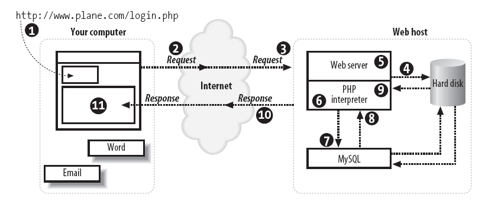
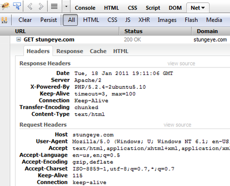

<!-- prettier-ignore-start -->
# HTTP and the Web
{: .no_toc }


## Table of Contents
{: .no_toc .text-delta }

1. TOC
{:toc}
<!-- prettier-ignore-end -->

## Introduction


HTTP, the Hypertext Transfer Protocol, is the network protocol of the Web. It is both simple and powerful. As web programmers it is important that you understand how this protocol works and how best to work with it when you develop server-side web applications.

The sticker in this photo appears on [the world's first web server](http://www.flickr.com/photos/scobleizer/2251820987/). That's the handwriting of Sir Tim Berners-Lee's on the computer that he used to invent the World Wide Web.

#### Resources

- [How Web Servers Work](http://computer.howstuffworks.com/web-server.htm)
- [Sir Tim Berners-Lee](http://en.wikipedia.org/wiki/Tim_Berners-Lee)

## Objectives

Upon completion of this module, you should be able to:

- Describe the use of the HTTP protocol for client-server communication.
- Describe and or illustrate a typical HTTP client-server interaction.
- Describe the purpose of the HTTP verbs (GET, POST).
- Use the $_GET and $\_POST superglobals in PHP scripts to retrieve data sent using GET or POST parameters.

## Hypertext Transfer Protocol


HTTP stands for Hypertext Transfer Protocol. It is the network protocol used to transfer all files and other data (collectively called _resources_) on the World Wide Web. There resources can be files, images, dynamically-generated web-pages, or any other data that can be identified using a URL (Uniform Resource Locator).

It is important to note that HTTP is _stateless_. The client and server are aware of each other only during a single request. By default, no information about any request is retained by either client or server, although responses are often cached by the client.

#### Resources

- [HTTP Made Really Easy](http://www.jmarshall.com/easy/http/)
- [How the web works](http://www.garshol.priv.no/download/text/http-tut.html): HTTP and CGI explained
- [HTTP Tutorial](http://www.tutorialspoint.com/http/index.htm)
- [URL @ Wikipedia](http://en.wikipedia.org/wiki/Uniform_Resource_Locator)

## HTTP Client-Server Interaction



1. You enter a web page URL in your browser's location bar.

2. (a) Your browser splits the URL into a host and a page path. An HTTP GET request for the specified page is made to the host. For example, http://www.plane.com/login.php requests the page login.php from www.plane.com. (b) Your computer uses DNS to convert the host domain to an IP address and then connects your browser to this IP using TCP/IP.

3. The web server process on the host receives the request for login.php.

4. The web server reads the login.php file from the host's hard drive.

5. The web server detects that the PHP file isn't just a plain HTML file, so it asks another process -- the PHP interpreter -- to process the file.

6. The PHP interpreter executes the PHP code that it finds in the text it received from the web server process. Included in that code are calls to the MySQL database.

7. PHP asks the MySQL database process to execute the database calls.

8. The MySQL database process returns the results of the database query.

9. The PHP interpreter completes execution of the PHP code with the data from the database and returns the results to the web server process.

10. The web server returns the results in the form of HTML text to your browser, along with a HTTP status code of 200.

11. Your web browser uses the returned HTML text to build the web page on your screen.

## GET vs POST

HTTP defines a number of verbs to indicate the desire action to be performed on the identified resource. There are nine verbs altogether. Here are the four most commonly used HTTP verbs.

- **GET** - Requests a representation of the specified resource. Requests using GET "SHOULD NOT have the significance of taking an action other than retrieval".
- **POST** - Submits data to be processed (e.g., from an HTML form) to the identified resource.
- **PUT** - Uploads a representation of the specified resource.
- **DELETE** - Deletes the specified resource.

In this course we will be working exclusively with GET and POST requests. This is because (X)HTML web forms do not support the PUT and DELETE verbs.

## HTTP Status Codes

All HTTP responses sent by a server will include an HTTP status code. Some of the most common status codes are:

- 200 OK : The request is OK.
- 404 Not Found : The server can not find the requested page.
- 500 Internal Server Error : The server met an unexpected condition.

#### Resources

- [HTTP Status Codes](http://www.tutorialspoint.com/http/http_status_codes.htm)
- [HTTP Status Code Flow Chart](http://viswaug.files.wordpress.com/2008/11/http-headers-status1.png)

## HTTP Headers



HTTP requests and responses are often accompanied by header lines. These headers contain the operating parameters of an HTTP request or response. This information is normally hidden from the user, however we can see it if we peak at an HTTP request/response using the Firebug plugin.

Some headers that we make use of in this course:

- Location
- Content-Type
- Authorization

#### Resources

- [List of HTTP Header Fields](http://en.wikipedia.org/wiki/List_of_HTTP_header_fields)

## Manual HTTP Requests

HTTP is a text based protocol. This means we can impersonate an HTTP client and communicate directly with a web server. Using telnet connect to stungeye.com on port 80:

```
telnet stungeye.com 80
```

The response should be something like this:

```
Trying 67.207.147.193...
Connected to stungeye.com.
Escape character is '^]'.
```

Next we can type:

```
GET /index.php HTTP/1.1
Host: stungeye.com [enter][enter]
```

Here we are using a `GET` to request the root document. We have also made use of a `Host` header. (The reason this is required is that multiple domains are being hosted by this server.) The server will respond with following response code and headers followed by the (X)HTML source of the requested page:

```
HTTP/1.1 200 OK
Date: Tue, 18 Jan 2011 18:38:35 GMT
Server: Apache/2
X-Powered-By: PHP/5.2.4-2ubuntu5.10
Connection: close
Content-Type: text/html
```

Note that the headers reveal the server's OS and the version of PHP being used.

## URL Encoding

Although filenames and paths can contain all sorts of characters, URLs can only contain alpha-numeric characters (0-9a-zA-Z) and the following reserved characters:

```
\$ - \_ . + ! \* ' ( ) ,
```

URLs that contain other characters need to be converted. URL encoding replaces the non-permitted characters with "%" followed by a [two digit hex code](http://www.blooberry.com/indexdot/html/topics/urlencoding.htm).

For example, URLs cannot contain spaces. URL encoding normally replaces a space with a + sign or the code %20.

#### Resources

- [URL Encode/Decode Tool](http://meyerweb.com/eric/tools/dencoder/)
- [Percent-Encoding @ Wikipedia](http://en.wikipedia.org/wiki/Percent-encoding)

## GET Parameters

Key-value parameters can be sent with an HTTP GET request by encoding the parameters at the end of a URL. If the requested page is a PHP script these extra parameters will be made available to the script.

For example, given the following URL:

`http://example.com/index.php?page=extra&ghost=casper&starsign=libra&number=42`

Four keys are defined, each with an associated value:

- page => extra
- ghost => casper
- starsign => libra
- number => 42

**Note:** To include this link in an HTML document we would have to "entitize" the ampersands as `&amp;` like so:

`http://example.com/index.php?page=extra&amp;ghost=casper&amp;starsign=libra&amp;number=42`

## PHP and GET Params

To retrieve the data sent to a PHP script by way of a GET parameters we use the `$_GET` super global.

```php
<!DOCTYPE html>
<html lang="en">
<head>
    <meta charset="utf-8">
    <title>Working with $_GET</title>
</head>
<body>
    <h2>Contents of the $_GET Superglobal</h2>
    <pre><?php print_r($_GET) ?></pre>
    <p>
        <a href="?happy=true&amp;hidden_monkies=12">Link with Parameters</a>.
    </p>
</body>
</html>
```

#### Resources

**Important:** GET requests and GET parameters should never be used to modify or add to a back-end database. Database modifications should only ever be the result of POST requests and POST parameters. This is because GET requests are supposed to be [safe and idempotent](https://www.w3.org/Protocols/rfc2616/rfc2616-sec9.html).

## POST Parameters

HTTP POST requests are used to send key/value pairs to a PHP script for the purpose of changing the state of a web-application. In the context of this course we will be using POST requests to change of our MySQL database tables.

Unlike GET request, the parameters sent via a POST request are not displayed in the requested URL. The POST parameters are sent as key/value pairs within a HTTP header.

In PHP scripts they are accessible via the `$_POST` superglobal.

## PHP and POST Params

POST parameters are sent using HTML forms where the `method` attribute is set to `post`.

In the following example, the script POSTs back to itself because the form has no `action` attribute.

```php
<?php
    if ($_POST) {
      // If we are responding to a POST...
    }
?>
<!DOCTYPE html>
<html lang="en">
<head>
    <meta charset="utf-8">
    <title>Working with $_POST</title>
</head>
<body>
    <form method="post">
        <label for="title">Title:</label>
        <input name="title" id="title">
        <label for="content">Content:</label>
        <textarea name="content"></textarea>
        <input type="submit" value="Submit">
    </form>

    <h2>The Contents of the $_POST Superglobal</h2>
    <pre><?php print_r($_POST) ?></pre>
</body>
</html>
```
